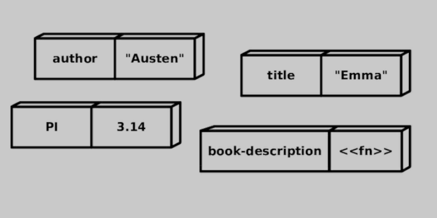
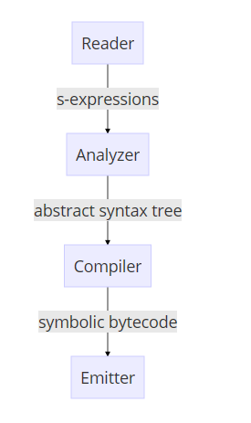

# Clojure

# Learning Resources

* Crash course: [https://dev.to/adasomg/10-life-changing-minutes-with-clojure-windows-3ofl](https://dev.to/adasomg/10-life-changing-minutes-with-clojure-windows-3ofl)
* Syntax in 15 mins: [https://github.com/shaunlebron/ClojureScript-Syntax-in-15-minutes](https://github.com/shaunlebron/ClojureScript-Syntax-in-15-minutes)
* Brave Clojure: <https://www.braveclojure.com/do-things/>
* S-expressions [http://www.buildyourownlisp.com/chapter9_s_expressions](http://www.buildyourownlisp.com/chapter9_s_expressions)
* Clojure for DSL: [https://purelyfunctional.tv/courses/domain-specific-languages-in-clojure/](https://purelyfunctional.tv/courses/domain-specific-languages-in-clojure/)
* Rich Hickey talks: [https://github.com/matthiasn/talk-transcripts](https://github.com/matthiasn/talk-transcripts)
* Get going fast
  https://medium.com/@daniel.oliver.king/a-clojure-development-environment-that-gets-out-of-your-way-c11e6711ead3
  https://medium.com/@daniel.oliver.king/getting-work-done-in-clojure-the-building-blocks-39ad82796926
  https://medium.com/@daniel.oliver.king/getting-real-work-done-in-clojure-application-development-683c8129a313

## Calva Bindings

(C=ctrl,A=Alt)

* C-A-c entr => loading current file & dependencies
* C-A-c v => eval current form inline
* C-A-c spc => eval current top level form
* C-w => grow selection
* Aldd C-A modifier to second chord to send to repl. Ex: C-A-c C-A-v

# Environment

* VSCode extension: [https://calva.io/](https://calva.io/)
* Summary of vscode for clojure: [https://www.admiralbumblebee.com/programming/2020/01/04/Six-months-VS-Code.html](https://www.admiralbumblebee.com/programming/2020/01/04/Six-months-VS-Code.html)
* Runtimes:
  * ClojureCLR: [https://github.com/clojure/clojure-clr/tree/newframework](https://github.com/clojure/clojure-clr/tree/newframework)
  * ClojureCLR fork for  Unity:  [https://github.com/arcadia-unity/clojure-clr](https://github.com/arcadia-unity/clojure-clr)
  * Magic Compiler: [https://github.com/nasser/magic](https://github.com/nasser/magic)
  * ClojureCLR nREPL: [https://github.com/arcadia-unity/Arcadia/blob/master/Editor/NRepl.cs](https://github.com/arcadia-unity/Arcadia/blob/master/Editor/NRepl.cs)

# General Notes

* vectors,maps are functions

````clojure
() [] {} #{} ;lists,vector,maps,sets
=> (def v ["a" "vector"]) ;; square brackets denote vectors
=> (v 0) ;; a function just like "nth". Interesting.
"a"

;; keyword is a first-class value type in clojure
=> (def m {:key "value", :another-key "almost like js right?"}) 
=> (type :key)
clojure.lang.Keyword

````

* symbols (== identifiers) are values i.e. take up memory
  * `'author` => get at symbol
* vars (== symbol to value bindings) are also values
  * `#'author` => get at var
    
  * `binding` expr for rebind value temporarily inside this scope
  * must mark with `^:dynamic` meta data
  * convention is to name var with **
  ````clojure
  (def ^:dynamic *debug-enabled* false)
  (defn debug [msg] 
  	(if *debug-enabled* 
       (println msg)))
  (binding [*debug-enabled* true]
      (debug "Calling that darned function")
      (some-troublesome-function-that-needs-logging)
      (debug "Back from that darned function"))
  ````

## Debugging

* `(pst)` -> print callstack

## DSL/Compiler

## DSL/Compiler



* reader: parser that should use treesitter for

* clojure.tools.analyzer: generates AST from clojure syntax. syntax form -> node hashmap

* ferret

* Tools/libs
  
  * clojure.tools.analyzer: https://github.com/clojure/tools.analyzer
  * https://github.com/stuartsierra/dependency
  * Terra (Lua metaprogramming layer over C ): <http://terralang.org/>
  * Gamma  (clj > glsl compiler): https://github.com/kovasb/gamma
  * https://github.com/thi-ng/shadergraph
  * tree shaping
    * Instaparse: https://github.com/Engelberg/instaparse
    * https://lambdaisland.com/blog/2018-11-26-art-tree-shaping-clojure-zip
    * https://clojuredocs.org/clojure.core/tree-seq
    * https://github.com/clojure/core.match
    * clojure enlive
  * treesitter implementations: 
    * https://github.com/sogaiu/tree-sitter-clojure
    * https://www.reddit.com/r/Clojure/comments/fkc6uv/is_anyone_working_on_a_treesitter_parser_for/fksmf67?utm_source=share&utm_medium=web2x
    * https://github.com/oakmac/tree-sitter-clojure

## Meander

# Meander

## Common Patterns

### Capture Variable From Pattern Match

* How to capture a variable from a pattern match? Use `:as`
  ````clojure
  (def a_opprmdefblk [(ophirPrmDef :inBoneTrk ctidChannel #{:EArg-In})
                      (ophirPrmDef :inoutBoneTrk ctidChannel #{:EArg-In :EArg-Out})
                      (ophirPrmDef :outBoneTrk ctidChannel #{:EArg-Out})])
  (m/search
   a_opprmdefblk
   [(m/or {:argFlags #{:EArg-Out} :as !argOut}
          {:argFlags #{:EArg-In} :as !argIn})
    ...]
   {:opmirArgIn !argIn
    :opmirArgOut !argOut})
  ````

### Sequence Transformation

* Desired Result
  
  ````clojure
  ;EBNF
  ns <= "obj" | "oppas" | "dc"
  segattr <= ["/"] "@" alphanumeric
  segobj  <= ["/"] alphanumeric
  xpath   <= ns (segattr|segobj) {(segattr|segobj)}
  
  ; Input
  "obj:/myobj/mychild/@myattrib"
  ;; Result =>
  {:ns :obj,
  :xsegs
  ({:segkind :seg-chld, :segpath ""}
    {:segkind :seg-chld, :segpath "myobj"}
    {:segkind :seg-chld, :segpath "mychild"}
    {:segkind :seg-attr, :segpath "@myattrib"})}
  ````

* What this shows:
  
  * Input: a tokenized string
  * Make sure tokens match order pattern (`nstoken xseg {xseg}` )
  * Transform each of the tokens based on the token
    ````clojure
    nstoken =>
      case "obj": :objstore
      default: (keyword nstoken)
    ````

* **Normal Clojure**
  
  ````clojure
  (defn initOppath-clj [axpath]
      (let [nsandpath (str/split axpath #"[:]" 2)
            nsstr (first nsandpath)
            pathtokens (->
                        nsandpath
                        (nth 1)
                        (str/split #"[/]"))]
        {:ns (case nsstr
               "op"    :op
               "obj"   :obj
               "oppas" :oppas)
         :xsegs (map
                 #(if (= (first %1) \@)
                    (->OppathSeg :seg-attr %1)
                    (->OppathSeg :seg-chld %1))
                 pathtokens)}))
  ````

* **Meander**
  
  * **Naive attempt**: 
    
    ````clojure
    (defn initOppath-m1 [axpath]
      (let [axptokens (str/split axpath #"[/:]")]
        {:ns (m/match (first axptokens)
               (m/and ?ns (m/or "op" "obj" "oppas"))
               (keyword ?ns))
         :xsegs (map
                 #(if (= (first %1) \@)
                    (->OppathSeg :seg-attr %1)
                    (->OppathSeg :seg-chld %1))
                 (rest axptokens))}))
    ````
  
  * **Second Attempt:** Better but a nitpick is the functional transformation is on the pattern matching clause where conceptually feels like it should go in the generation part
    
    ````clojure
    (defn initOppath-m2 [axpath]
          (m/match (str/split axpath #"[/:]")
            (m/with [%segattr (m/pred #(= (first %1) \@)    (m/app #(->OppathSeg :seg-attr %1) !seg))
                     %segobj  (m/pred #(not= (first %1) \@) (m/app #(->OppathSeg :seg-chld %1) !seg))]
                    [(m/re #"obj|oppas|dc" ?ns)
                     . (m/or %segobj %segattr) ...])
            {:ns (keyword ?ns) :xsegs !seg}))        
    ````
  
  * **Cleaner Solution** Use a helper to construct the xseg:
    
    ````clojure
    (defn make-xseg [val]
      (m/rewrite val
        (m/re #"@.*" ?val)
        {:kind :seg-attr :val ?val}
    
        (m/re #"[^@].*" ?val)
        {:kind :seg-chld :val ?val}
    
        ?val
        {:kind :unknown :val ?val}))
    
    
    (m/rewrite ["oppas" "obj1" "@attr1" "@attr2" "obj2"]
      [(m/re #"obj|oppas|dc" ?ns) . !segs ...]
      {:ns (m/keyword ?ns)
       :xsegs [(m/app make-xseg !segs) ...]})
    ;; =>
    {:ns :oppas,
     :xsegs
     [{:kind :seg-chld, :val "obj1"}
      {:kind :seg-attr, :val "@attr1"}
      {:kind :seg-attr, :val "@attr2"}
      {:kind :seg-chld, :val "obj2"}]}
    ````
  
  * **Concise Using Recursion**: The second uses `m/cata` on the left or right side:
    
    * Left side
      
      ````clojure
      (m/rewrite ["oppas" "obj1" "@attr1" "@attr2" "obj2"]
        [(m/re #"obj|oppas|dc" ?ns) . (m/cata !segs) ...]
        {:ns (m/keyword ?ns)
         :xsegs [!segs ...]}
      
        (m/re #"@.*" ?val)
        {:kind :seg-attr :val ?val}
      
        (m/re #"[^@].*" ?val)
        {:kind :seg-chld :val ?val}
      
        ?val
        {:kind :unknown :val ?val})
      ````
    
    * Right side
      
      ````clojure
      (m/rewrite ["oppas" "obj1" "@attr1" "@attr2" "obj2"]
        [(m/re #"obj|oppas|dc" ?ns) . !segs ...]
        {:ns (m/keyword ?ns)
         :xsegs [(m/cata !segs) ...]}
      
        (m/re #"@.*" ?val)
        {:kind :seg-attr :val ?val}
      
        (m/re #"[^@].*" ?val)
        {:kind :seg-chld :val ?val}
      
        ?val
        {:kind :unknown :val ?val})
      ````
  
  * **Final Solution:** Cata on the right side can be used to construct a value to be recursively rewritten. It’s the dual of the left.
    
    ````clojure
    (m/rewrite ["oppas" "obj1" "@attr1" "@attr2" "obj2"]
      [(m/re #"obj|oppas|dc" ?ns) . !segs ...]
      {:ns (m/keyword ?ns)
       :xsegs [(m/cata ($EXAMPLE !segs)) ...]}
    
      ($EXAMPLE (m/re #"@.*" ?val))
      {:kind :seg-attr :val ?val}
    
      ($EXAMPLE (m/re #"[^@].*" ?val))
    
      {:kind :seg-chld :val ?val}
    
      ($EXAMPLE ?val)
      {:kind :unknown :val ?val})
    ;; =>
    {:ns :oppas,
     :xsegs
     [{:kind :seg-chld, :val "obj1"}
      {:kind :seg-attr, :val "@attr1"}
      {:kind :seg-attr, :val "@attr2"}
      {:kind :seg-chld, :val "obj2"}]}
    ````

### Split stream based on filter and project   (1-to-many)

* Pseudo code:
  
  ````clojure
  filter(
    (predA? x) => (projA x) :as !projAseq
    (predB? x) => (projB x) :as !projBseq
  )
  ````

* Clojure Code
  
  ````clojure
  ;; Test Data
  (def arglist [{:name :inBoneTrk    :argFlags #{:EArg-In}}
                {:name :inoutBoneTrk :argFlags #{:EArg-In :EArg-Out}}
                {:name :outBoneTrk   :argFlags #{:EArg-Out}}])
  ;; Using match
  (m/match
   arglist
    [(m/or {:argFlags #{:EArg-Out} :as !argOut}
           {:argFlags #{:EArg-In} :as !argIn})
     ...]
    {:opmirArgIn !argIn
     :opmirArgOut !argOut})
  ;; =>
  {:opmirArgIn  [{:name     :inBoneTrk
                  :argFlags #{:EArg-In}}]
   :opmirArgOut [{:name     :inoutBoneTrk
                  :argFlags #{:EArg-Out :EArg-In}} 
                 {:name     :outBoneTrk
                  :argFlags #{:EArg-Out}}]}
  
  ````

* Now let's use m/search to see the difference
  
  ````clojure
  (m/search
   arglist
   [(m/or {:argFlags #{:EArg-Out} :as !argOut}
          {:argFlags #{:EArg-In} :as !argIn})
    ...]
   {:opmirArgIn !argIn
    :opmirArgOut !argOut})
  ;; =>
  ({:opmirArgIn [{:name :inBoneTrk, :argFlags #{:EArg-In}}]
    :opmirArgOut [{:name :inoutBoneTrk, :argFlags #{:EArg-Out :EArg-In}} 
                  {:name :outBoneTrk, :argFlags #{:EArg-Out}}]}
   {:opmirArgIn [{:name :inBoneTrk, :argFlags #{:EArg-In}} 
                 {:name :inoutBoneTrk, :argFlags #{:EArg-Out :EArg-In}}]
    :opmirArgOut [{:name :outBoneTrk, :argFlags #{:EArg-Out}}]})
  ````

* Now let's look using m/scan
  
  ````clojure
  (m/search
   arglist
   (m/scan {:argFlags #{:EArg-In} :as ?argIn})
   ?argIn)
  ;; =>
  ({:name     :inBoneTrk
    :argFlags #{:EArg-In}} 
   {:name     :inoutBoneTrk
    :argFlags #{:EArg-Out :EArg-In}})
  ````

* Now let's look at m/scan with a memory variable
  
  ````clojure
  (m/search
   arglist
   (m/scan {:argFlags #{:EArg-In} :as !argIn})
   !argIn)
  ;; =>
  ([{:name     :inBoneTrk
     :argFlags #{:EArg-In}}]
   [{:name     :inoutBoneTrk
     :argFlags #{:EArg-Out :EArg-In}}])
  ````

---

## TODO

* How to do EBNF like production rules.  Ex: 
  ````clojure
  token ::= (:arg-in|:arg-out) ?argname
  pseudocode-result:: (str (emit-in ?arg-attr)|emit-out :arg-attr) ?argname)    
  ````

---
