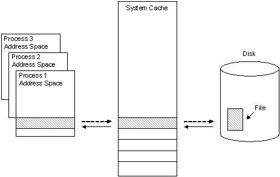

# File Caching

By default, Windows caches file data that is read from disks and written to disks. This implies that read operations read file data from an area in system memory known as the system file cache, rather than from the physical disk. Correspondingly, write operations write file data to the system file cache rather than to the disk, and this type of cache is referred to as a write-back cache. Caching is managed per file object.

Caching occurs under the direction of the cache manager, which operates continuously while Windows is running. File data in the system file cache is written to the disk at intervals determined by the operating system, and the memory previously used by that file data is freed—this is referred to as flushing the cache. The policy of delaying the writing of the data to the file and holding it in the cache until the cache is flushed is called lazy writing, and it is triggered by the cache manager at a determinate time interval. The time at which a block of file data is flushed is partially based on the amount of time it has been stored in the cache and the amount of time since the data was last accessed in a read operation. This ensures that file data that is frequently read will stay accessible in the system file cache for the maximum amount of time.

This file data caching process is illustrated in the following figure.

As depicted by the solid arrows in the previous figure, a 256 KB region of data is read into a 256 KB cache "slot" in system address space when it is first requested by the cache manager during a file read operation. A user-mode process then copies the data in this slot to its own address space.

The amount of I/O performance improvement that file data caching offers depends on the size of the file data block being read or written. When large blocks of file data are read and written, it is more likely that disk reads and writes will be necessary to finish the I/O operation. I/O performance will be increasingly impaired as more of this kind of I/O operation occurs.

In these situations, caching can be turned off. This is done at the time the file is opened by passingFILE_FLAG_NO_BUFFERING as a value for the dwFlagsAndAttributes parameter of CreateFile. When caching is disabled, all read and write operations directly access the physical disk. However, the file metadata may still be cached. To flush the metadata to disk, use the FlushFileBuffers function.

From <http://msdn.microsoft.com/en-us/library/windows/desktop/aa364218(v=vs.85).aspx>

# File Buffering

When opening or creating a file with the CreateFile function, the FILE_FLAG_NO_BUFFERING flag can be specified to disable system caching of data being read from or written to the file. Although this gives complete and direct control over data I/O buffering, in the case of files and similar devices there are data alignment requirements that must be considered.

In a simple example, the application would open a file for write access with the FILE_FLAG_NO_BUFFERING flag and then perform a call to the WriteFile function using a data buffer defined within the application. This local buffer is, in these circumstances, effectively the only file buffer that exists for this operation. Because of physical disk layout, file system storage layout, and system-level file pointer position tracking, this write operation will fail unless the locally-defined data buffers meet certain alignment criteria, discussed in the following section.

From <http://msdn.microsoft.com/en-us/library/windows/desktop/cc644950(v=vs.85).aspx>

# File read performance

Mmap vs fread http://lemire.me/blog/archives/2012/06/26/which-is-fastest-read-fread-ifstream-or-mmap/

**FILE_FLAG_NO_BUFFERING**
From <http://msdn.microsoft.com/en-us/library/windows/desktop/cc644950(v=vs.85).aspx>

<http://msdn.microsoft.com/en-us/library/windows/desktop/aa364218(v=vs.85).aspx>
<http://stackoverflow.com/questions/236861/how-do-you-determine-the-ideal-buffer-size-when-using-fileinputstream>
