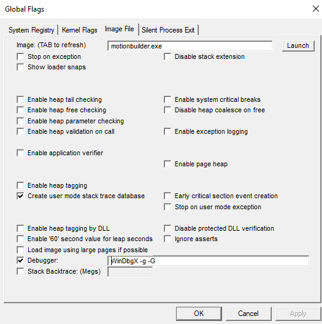

# Windows Debugging

## Postmortem Debugging

- Configure System Crash Dump Options
  
  - UI: `Windows Settings->About->Advanced Tab->Startup and Recovery Settings`
  - Registry Key: `HKEY_LOCAL_MACHINE\SYSTEM\CurrentControlSet\Control\CrashControl`
- Configuring postmortem debugger: `HKEY_LOCAL_MACHINE\SOFTWARE\Microsoft\Windows NT\CurrentVersion\AeDebug`
  
  - _**`Debugger=REG_SZ:[DebuggerCmd]` value:**_ specify postmortem debugger where `[DebuggerCmd]` is invocation command
    - _1st `%ld`:_ replaced with the `Process ID`
    - _2nd `%ld`:_ replaced with the `Event Handle`
    - Ex: `"C:\debuggers\windbg.exe" -p %ld -e %ld -g`
  - _**`Auto=REG_SZ:[0|1]` value:**_ configure automatic debugging behavior
    - `0`: disable auto invoke and show user interaction dialog
    - `1`: enable auto invoke and hide user interaction dialog
  - _**`.\AutoExclusionList\[ExeName]=dword:00000001` value:**_ exclude `[ExeName]` from automatic debugging e.g.
    - `"DWM.exe"=dword:00000001`
- [(Reference)](https://learn.microsoft.com/en-us/windows/win32/debug/configuring-automatic-debugging)

## Windows Debugging Tips

### GFlags

Global Flags Editor (`WindowsSDK\Debuggers\x64\gflags.exe`) enables/disables advanced windows diagnostic settings/registry keys

- features
  
  - advanced debugging settings e.g. break on process launch
  - page heap allocation monitoring/verification
  - kernel object reference tracing
- 
   > 
   > \[!warning\] `gflags.exe` **must be run as admin** to set windows debug settings

- [GFlags Reference](https://docs.microsoft.com/en-us/windows-hardware/drivers/debugger/gflags)

### SysInternals

Collection of useful system troubleshooting tools

- `WinObj` shows all the OS objects
- `SigCheck -a sftvolwin7.sys`: verify valid signature and shows file version info
- `TCPView`: see all network traffic
- `Procmon`: count occurrences; result will collate all errors
