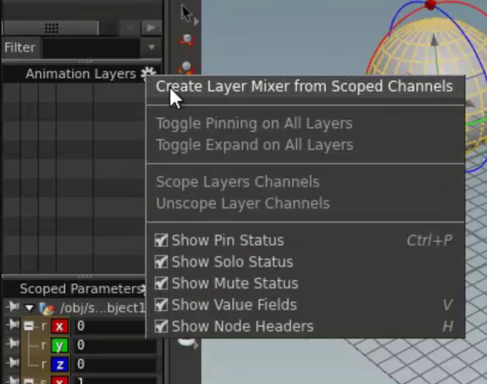
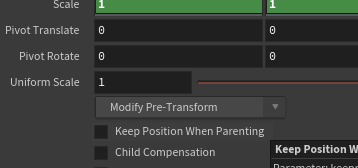
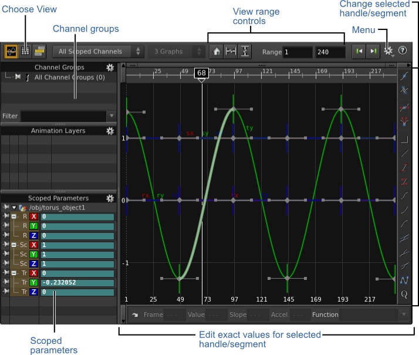

# Animation & Rigging

## Channel Scoping

- Channels that will be keyed if you press k
- Can create Animation Layer from scoped channels
  
- Attach to parent and keep relative offset: select keep positioning when parenting
- Child Compensation: Tells houdini to keep world space xform of children
  
  - you will need to do clean transform after on children to reset their xform.
  - Also make sure child compensation is unticked when you do this)

- Extract Pre-transform: After disconnecting, it will apply the hidden xform to the current object's transform
- Modify Shelf->Freeze
  - Bake the current transform into the object, sets the current pivot to the current xform, and zeros out xform

- Bones
  - How you draw them is what ends up being their rest position
  - Rest Pos: PreTransform + Rest = IK Rest
    - Must clear both to reset "default position"

## Pre/Post Constraint

The Get World Space CHOP grabs what Houdini calls the ‘preconstraint transform’. The first input in most CHOP constraint setups will be this node pointing to the object being constrained (with the relative path “../..”). This prevents recursion problems.

In your case you'll be wanting to use the node listed as ‘Object (Constraints)’ under the network editor tab menu. This one fetches the final (post-constraint) world transform of the object, or the final relative transform to the node pointed to in the ‘Reference’ parameter (leave this blank for World Transform).

Be wary of recursion problems if you get too involved in intercepting/rebuilding transform hierarchies through constraints… Even though the ‘Get World Space’ chop node grabs the pre-constraint transform of the target object, that pre-constraint transform still contains any post-constraint transforms that are present in its parents. So attempting to set constraints on a parent object based upon a child object's preconstraint transform will still result in ‘infinite recursion’ errors.

[Reference](https://www.sidefx.com/forum/topic/56060/)

## PoseScope
- Allow you to select/define group polygons on a geo to drive bone controller

## CHOPS

[Reference](http://www.sidefx.com/docs/houdini/ref/panes/changraph)

- Broadcast export to multiple objects by using glob pattern in export:
  - you can put a rename node/export node and set the export prefix to `/obj/hammer*`
  - this will export the channel to every channel that matches that pattern

## Useful functions

| Vex functions            | Description                                               |
| ------------------------ | --------------------------------------------------------- |
| opparentbonetransform    | Returns the parent bone transform associated with an OP   |
| opparenttransform        | Returns the parent transform associated with an OP        |
| opparmtransform          | Returns the parm transform associated with an OP          |
| oppreconstrainttransform | Returns the preconstraint transform associated with an OP |
| oppretransform           | Returns the pretransform associated with an OP            |
| optransform              | Returns the transform associated with an OP               |

| CHOP Expression        | Description             |
| ---------------------- | ----------------------- |
| icmin(0,0), icmax(0,0) | Get the channel min/max |