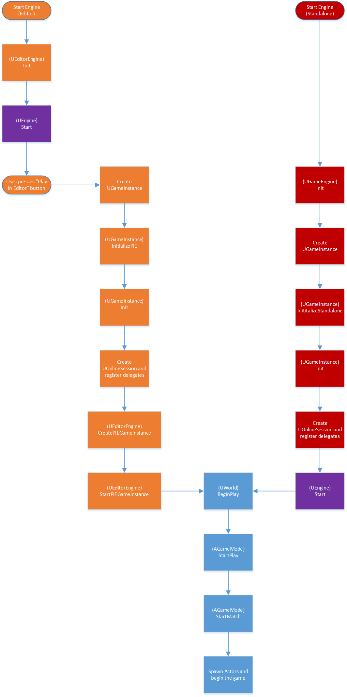

# Game Flow Diagram

[Related: Detailed Actor LifeCycle Diagram](/ue4guide/gameplay-programming/actor-tick-lifecycle-flow/actor-lifecycle-diagram/)

# Details

Numbers signify steps not necessarily at the same class nesting

- UGameEngine::Init

  - UGameInstance::InitializeStandalone()
    - UGameInstance::Init() - CreateUOnlineSession and Register Delegates()

- UGameEngine::Start

  - UGameInstance::StartGameInstance()=>

    - UEngine::LoadMap()

      1. UWorld::InitializeActorsForPlay() - Call register components on all actor components in all levels. Note: Construction scripts are rerun in uncooked mode

         - UActorComponent::RegisterComponent() - Adding itself to its owner and inside owner's world, possibly creating rendering/physics state

      2. ABBGameModeBase::InitGame - Create the Game Session and register FGameDelegates (ex: PreCommitMapChangeDelegate, HandleDisconnectDelegate)

      3. Ulevel::RouteActorInitialize() -

         - a) Actor::PreInitializeComponents() - On all actors in the level

           - **Side Note:** AGameModeBase::PreInitializeComponents() creates

             - AGameStateBase and calls InitGameState()

             - AGameNetworkManager which handles game-specific networking management (cheat detection, bandwidth management, etc)

         - b) Iterate through Ulevel::Actors\[] and call these functions on them one at a time

           - Actor::InitializeComponents()

             - UActorComponent::Activate() - Sets Component Tick To Be Enables & bIsActive = true

             - UActorComponent::InitializeComponent() - Place for components to Initialize themselves before BeginPlay (Actor or Component for anything in the world)

           - PostInitializeComponents() - Code that can run after gaurantee that all components have been initialized

         - c) Iterate through all Ulevel::ActorsToBeginPlay\[] and call BeginPlay() to allows code to run with assumption that all other level actors have been PostInitializeComponents()

           - Not sure why this is here instead of the main call to BeginPlay(possibly for networked late joins?)

      4. FWorldDelegates::OnWorldInitializedActors.Broadcast(OnActorInitParams)

1. Uworld::BeginPlay()

   - a) GameMode::StartPlay()

     - GameMode::StartMatch()

       - GameState::HandleBeginPlay()

         - AWorldSettings::NotifyBeginPlay()

           - Actor::BeginPlay(), for all actors

             - UActorComponent::RegisterAllComponentTickFunctions() - Allows components to register multiple tick functions (ex: Physics tick, cloth tick in skeletalmeshcomponent)
             - UActorComponent::BeginPlay()

FEngineLoop::Tick()

- UGameEngine::Tick()

  - Uworld::Tick()

    - FTiskTaskManagerInterface::StartFrame()

      - Queues up all the TickFunctions according to their dependency graph & TickGroup

      - Ticking within each group is done by a dependency graph (AddTickPrerequisite) of tick functions of various objects during TickFunction registration

      - This function might change what TickGroup something runs in according to the prerequisite tick function's tickgroup

      - Actor Components do not necessarily tick after their owner Actor

    - Calls RunTickGroup() for various tick groups which ticks components

    - FTickableGameObject::TickObjects() - ticks UObjects or anything that derives from FTickableGameObject (e.g. SceneCapturerCubes or LevelSequencePlayers )

- FTicker::GetCoreTicker().Tick(FApp::GetDeltaTime()) - Ticks all objects of type FTickerObjectBase. Ex: FHttpManager, FAvfMediaPlayer, FVoiceCapture, FSteamSocketSubsystem)

  - This would be great place to add Objects that need to tick at the end of the frame that are engine/world agnostic

  - Good possible place for our own UDP network ticking replication

GameMode Flow:

- InitGame()
- InitGameState()
- PostInitializeComponents()
- ChoosePlayerStart_Implementation()
- PostLogin()
- HandleStartingNewPlayer_Implementation()
- ChoosePlayerStart_Implementation()
- SetPlayerDefaults()
- RestartPlayerAtPlayerStart()
- StartPlay()
